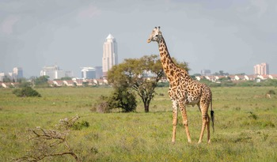
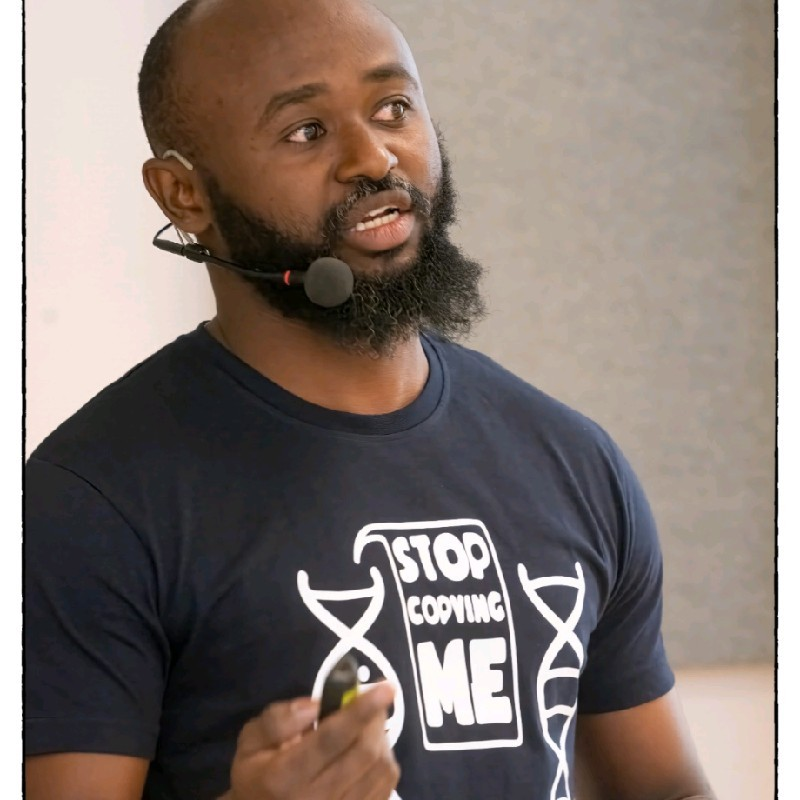
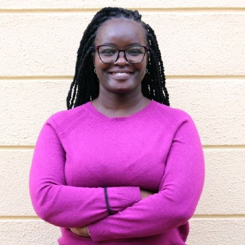
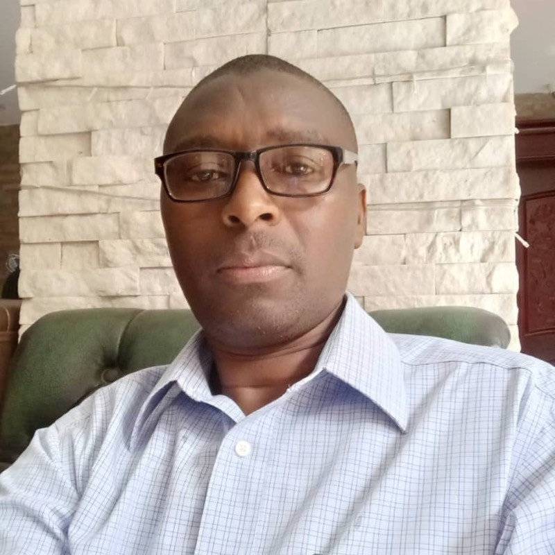
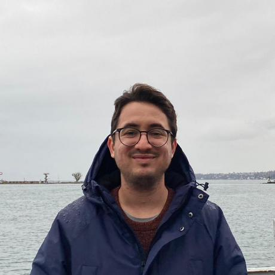

# Bioconductor Course | Nairobi, Kenya | March 2025

::: {.callout-note}
This workshop has now concluded. Thank you to all participants, instructors, and organisers for a successful event. Read the [blog post recap](https://blog.bioconductor.org/posts/2025-05-21-kenya-course/).
:::

{style="width:100%; max-height:500px; object-fit:cover; object-position:50% 40%; display:block; margin:0 auto;"}

## Event Details

- 📅 **Dates:** March 24 - 28, 2025
- 📍 **Location:** International Institute of Tropical Agriculture (IITA), Nairobi, Kenya
- 📘 **Format:** Week-long course (single registration covering all sessions)

## Overview

This intensive week-long Bioconductor course is designed to build bioinformatics capacity in Africa, focusing on practical skills in genomic data analysis and RNA-seq. Participants will gain hands-on experience with R and Bioconductor, guided by expert instructors from both local and international bioinformatics communities.

## Course Structure

- **March 24-25:** Introduction to R/Bioconductor for Genomic Data Analysis  
  Develop foundational skills in R and Bioconductor, including data handling, visualisation, and reproducible research practices tailored for genomic data analysis.

- **March 26-27:** RNA-seq Data Analysis and Interpretation  
  Dive into RNA-seq workflows, from preprocessing to differential expression analysis, and gain practical experience with real-world datasets.

- **March 28:** Bring Your Own Data (BYO) Day  
  Apply your skills to your own data or explore additional datasets, with personalised guidance and collaborative support from instructors.

## 🎓 Instructors

The workshop will be led by a team of Carpentries-certified instructors from the Bioconductor community, including both local bioinformatics experts and experienced international instructors. This blend ensures a diversity of perspectives and expertise, fostering a strong collaborative learning environment.  

::: {.grid style="display: grid; grid-template-columns: repeat(5, 1fr); gap: 20px; max-width: 1000px; margin: auto;"}

::: {.text-center style="display: flex; flex-direction: column; align-items: center; text-align: center;"}
{width=120 height=120 style="border-radius:50%;"} 

  **Laurent Gatto**  
  <em style="font-size: 14px; color: #555;">UCL, Belgium</em>

  <a href="https://lgatto.github.io/about/" target="_blank" style="display: flex; align-items: center; text-decoration: none; color: inherit;">
    🌐 Website
  </a>
  <a href="https://github.com/lgatto" target="_blank" style="display: flex; align-items: center; gap: 5px; text-decoration: none; color: inherit;">
     GitHub
  </a>

:::

::: {.text-center style="display: flex; flex-direction: column; align-items: center; text-align: center;"}
{width=120 height=120 style="border-radius:50%;"} 

  **Michael Landi**  
  <em style="font-size: 14px; color: #555;">IITA, Kenya</em>

  <a href="https://linkedin.com/in/michael-landi-490b33113" target="_blank" style="display: flex; align-items: center; gap: 5px; text-decoration: none; color: inherit;">
     LinkedIn
  </a>
  <a href="https://github.com/LandiMi2" target="_blank" style="display: flex; align-items: center; gap: 5px; text-decoration: none; color: inherit;">
     GitHub
  </a>

:::

::: {.text-center style="display: flex; flex-direction: column; align-items: center; text-align: center;"}
{width=120 height=120 style="border-radius:50%;"} 

  **Laurah Ondari**  
  <em style="font-size: 14px; color: #555;">IITA, Kenya</em>

  <a href="https://linkedin.com/in/nyasita-l-ondari-749175b6/" target="_blank" style="display: flex; align-items: center; gap: 5px; text-decoration: none; color: inherit;">
     LinkedIn
  </a>
  <a href="https://github.com/Nyasita" target="_blank" style="display: flex; align-items: center; gap: 5px; text-decoration: none; color: inherit;">
     GitHub
  </a>

:::

::: {.text-center style="display: flex; flex-direction: column; align-items: center; text-align: center;"}
{width=120 height=120 style="border-radius:50%;"} 

  **Zedias Chikwambi**  
  <em style="font-size: 14px; color: #555;">AiBST, Zimbabwe</em>

  <a href="https://linkedin.com/in/zedias-chikwambi-4a81b414" target="_blank" style="display: flex; align-items: center; gap: 5px; text-decoration: none; color: inherit;">
     LinkedIn
  </a>
  <a href="https://github.com/zchikwambi" target="_blank" style="display: flex; align-items: center; gap: 5px; text-decoration: none; color: inherit;">
     GitHub
  </a>

:::

::: {.text-center style="display: flex; flex-direction: column; align-items: center; text-align: center;"}
{width=120 height=120 style="border-radius:50%;"} 

  **Fabricio Almeida-Silva**  
  <em style="font-size: 14px; color: #555;">VIB, Belgium</em>

  <a href="https://almeidasilvaf.github.io/" target="_blank" style="display: flex; align-items: center; text-decoration: none; color: inherit;">
    🌐 Website
  </a>
  <a href="https://github.com/almeidasilvaf" target="_blank" style="display: flex; align-items: center; gap: 5px; text-decoration: none; color: inherit;">
     GitHub
  </a>

:::

:::

## Registration

A single registration covers the full week of sessions. Registration details, including the application form, will be posted soon. We welcome participants who are keen to develop their bioinformatics skills with a focus on genomic data analysis.

## Funding and Support

This workshop is part of Bioconductor’s expanded global training program, supported by the Chan Zuckerberg Initiative (CZI) through an EOSS Cycle 6 grant. You can read more about this and related projects [here](https://blog.bioconductor.org/posts/2024-07-12-czi-eoss6-grants/).

## Organisers

Trushar Shah (International Institute of Tropical Agriculture, Local Host), Maria Doyle (University of Limerick, Lead Organiser), Aedin Culhane (University of Limerick), Charlotte Soneson (Friedrich Miescher Institute for Biomedical Research), Laurent Gatto (Institut de Duve, UCLouvain), Umar Ahmad (Bauchi State University / Africa CDC), Zedias Chikwambi (African Institute of Biomedical Sciences and Technology).

## Contact

For questions, please email maria.doyle [at] ul.ie.

  <h2>🌍 Join the Bioconductor Africa Community</h2>
  
Stay informed about course registration opening, news, projects, and events in Africa.

  <iframe src="biocafrica-mailing-list.html" width="100%" height="400" style="border:none;"></iframe>

  
  
  
  

