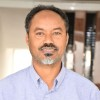
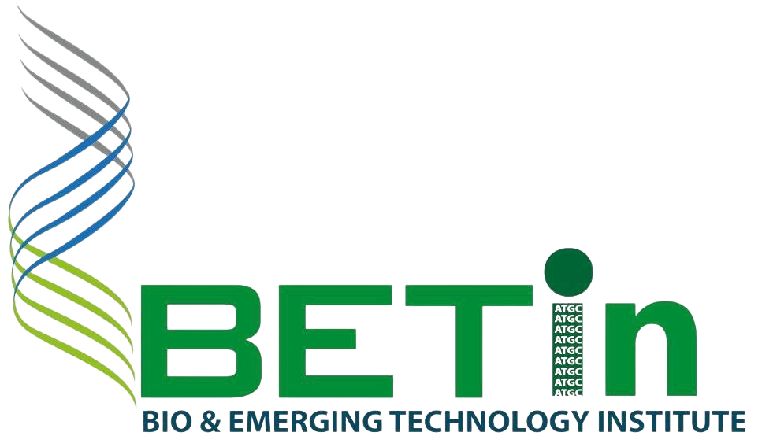
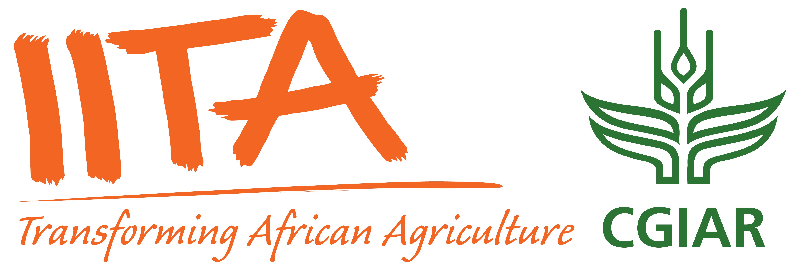

# Bioconductor Course | Addis Ababa, Ethiopia | August 2025

{style="width:100%; height:calc(60vh + 50px); object-fit:cover; object-position:50% 5%; display:block; margin:0 auto;"}

## Event Details

- 📅 **Dates:** August 25 - 29, 2025
- 📍 **Location:** [Bio & Emerging Technology Institute (BETin)](https://www.betin.gov.et/), Addis Ababa, Ethiopia
- 📘 **Format:** Week-long course (single registration covering all sessions)

## Overview

This intensive week-long Bioconductor course is designed to build bioinformatics capacity in Africa, focusing on practical skills in genomic data analysis and RNA-seq. Participants will gain hands-on experience with R and Bioconductor, guided by expert instructors from both local and international bioinformatics communities.

[Download the workshop flyer (PDF)](Bioconductor Poster - Addis.pdf).  

## Course Structure

- **August 25-26:** Introduction to R/Bioconductor for Genomic Data Analysis  
  Develop foundational skills in R and Bioconductor, including data handling, visualisation, and reproducible research practices tailored for genomic data analysis.

- **August 27-29:** RNA-seq Data Analysis and Interpretation  
  Dive into RNA-seq workflows, from preprocessing to differential expression analysis, and gain practical experience with real-world datasets.
  

> 📝 **Curious about what to expect?**  
> Take a look at the [recap of our March 2025 Nairobi workshop](https://blog.bioconductor.org/posts/2025-05-21-kenya-course/) for highlights, photos, and participant feedback from a recent Bioconductor course in Africa.

## 🎓 Instructors

The workshop will be led by a team of instructors from the Bioconductor community, including both local bioinformatics experts and experienced international instructors. This blend ensures a diversity of perspectives and expertise, fostering a strong collaborative learning environment.  

::: {.grid style="display: grid; grid-template-columns: repeat(4, 1fr); gap: 20px; max-width: 1000px; margin: auto;"}

::: {.text-center style="display: flex; flex-direction: column; align-items: center; text-align: center;"}
{width=120 height=120 style="border-radius:50%;"} 

  **Yohannes Gedamu**  
  <em style="font-size: 14px; color: #555;">BETin, Ethiopia</em>

  <a href="https://www.linkedin.com/in/yohannesgg/" target="_blank" style="display: flex; align-items: center; gap: 5px; text-decoration: none; color: inherit;">
     LinkedIn
  </a>

:::

::: {.text-center style="display: flex; flex-direction: column; align-items: center; text-align: center;"}
{width=120 height=120 style="border-radius:50%;"} 

  **Niguse Kelile**  
  <em style="font-size: 14px; color: #555;">BETin, Ethiopia</em>

  <a href="https://www.linkedin.com/in/niguse-kelile-lema/" target="_blank" style="display: flex; align-items: center; gap: 5px; text-decoration: none; color: inherit;">
     LinkedIn
  </a>

:::

::: {.text-center style="display: flex; flex-direction: column; align-items: center; text-align: center;"}
{width=120 height=120 style="border-radius:50%;"} 

  **Trushar Shah**  
  <em style="font-size: 14px; color: #555;">IITA, Kenya</em>

  <a href="https://www.linkedin.com/in/trushar-shah-55416a1/" target="_blank" style="display: flex; align-items: center; gap: 5px; text-decoration: none; color: inherit;">
     LinkedIn
  </a>

:::

::: {.text-center style="display: flex; flex-direction: column; align-items: center; text-align: center;"}
{width=120 height=120 style="border-radius:50%;"} 

  **Maria Doyle**  
  <em style="font-size: 14px; color: #555;">UL, Ireland</em>

  <a href="https://www.linkedin.com/in/maria-doyle-11220739/" target="_blank" style="display: flex; align-items: center; gap: 5px; text-decoration: none; color: inherit;">
     LinkedIn
  </a>

:::

:::

## Application

- **Cost:** Free (participants are responsible for their own travel and accommodation)
- **Application Deadline:** Rolling admissions starting August 8, 2025

➡️ [Apply for a place using the application form](https://forms.gle/hUa1xpA38Ajahsrs8). 

We welcome applications from individuals who are eager to build their bioinformatics skills in RNA-seq data analysis using R and Bioconductor.

Applications will be reviewed based on motivation, background, and potential to apply the training.

Please apply only if you are committed to attending all sessions in person and can cover your travel and accommodation costs.

## Funding and Support

This workshop is primarily funded by BETin, with additional support from Erasmus+ through UL Global, and from Bioconductor via a [Chan Zuckerberg Initiative (CZI) EOSS Cycle 6 grant](https://blog.bioconductor.org/posts/2024-07-12-czi-eoss6-grants/).

## Organisers

Zewdu Edea (Bio & Emerging Technology Institute), Yohannes Gedamu (Bio & Emerging Technology Institute), Niguse Kelile (Bio & Emerging Technology Institute), Trushar Shah (International Institute of Tropical Agriculture), Maria Doyle (University of Limerick).

## Contact

For questions, please contact the local organising team (details in the [application form](https://forms.gle/hUa1xpA38Ajahsrs8)), or email maria.doyle [at] ul.ie.

  <h2>🌍 Join the Bioconductor Africa Community</h2>
  
Stay informed about course registration opening, news, projects, and events in Africa.

  <iframe src="../2025-03-Nairobi/biocafrica-mailing-list.html" width="100%" height="400" style="border:none;"></iframe>

  
  
  
  
  
  

