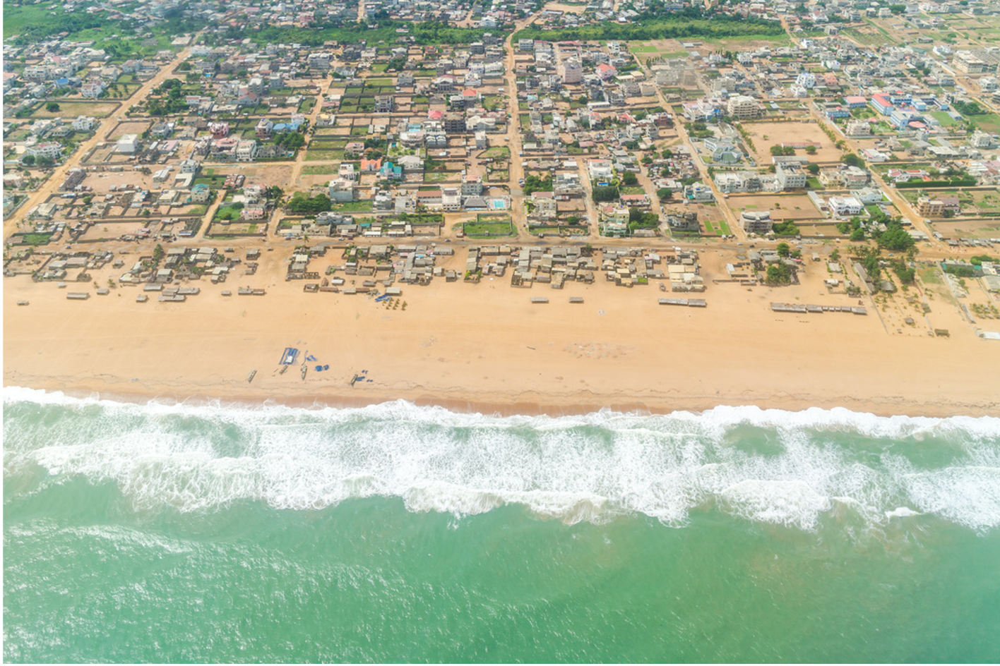
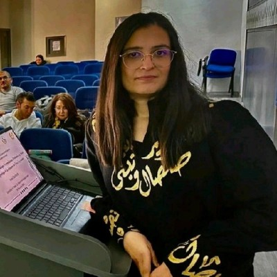
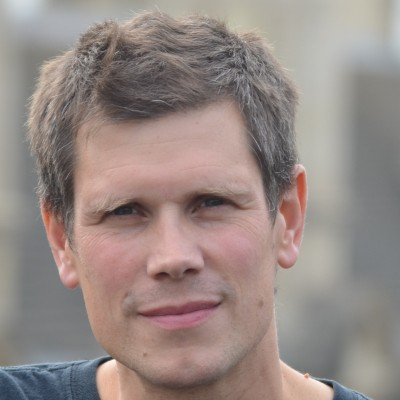
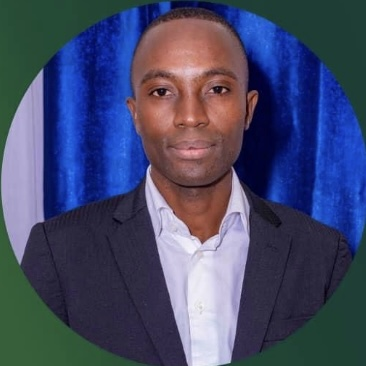
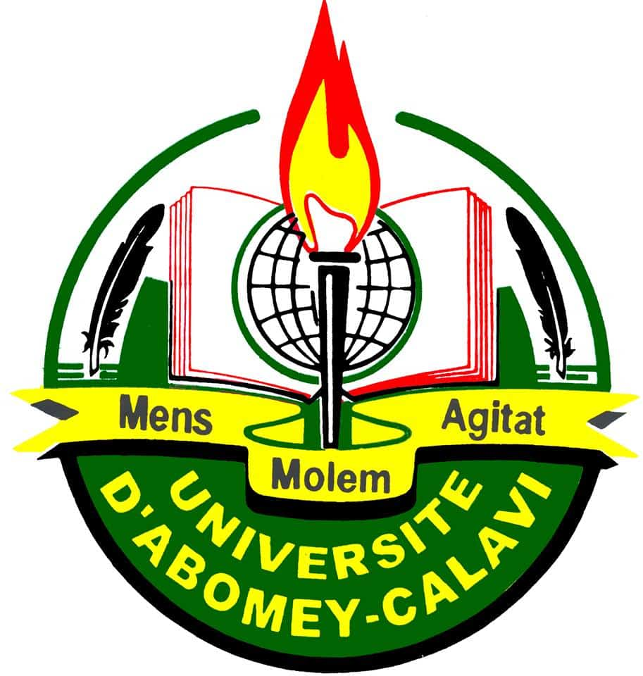
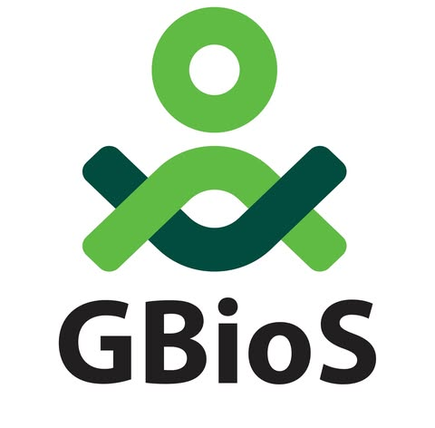
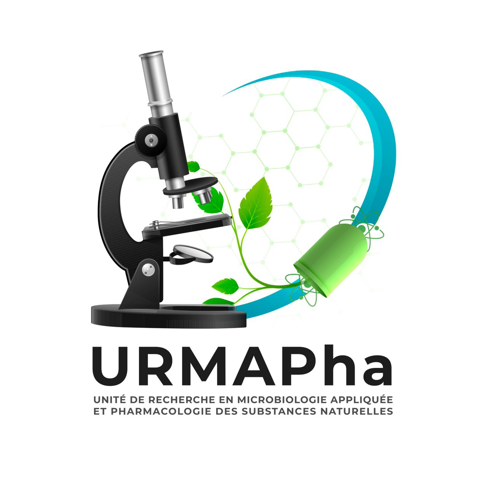

{fig-alt="Aerial view of Cotonou, Benin, where the city meets the sandy coastline of the Gulf of Guinea" width="100%" height="500" style="object-fit:cover; object-position:50% 40%; display:block; margin:0 auto;"}

## Event Details

- 📅 **Dates:** November 17 - 21, 2025
- 📍 **Location:** GBioS, University of Abomey-Calavi, Abomey-Calavi, Benin
- 📘 **Format:** Week-long course (single registration covering all sessions)

## Overview

This intensive, week-long Bioconductor course is designed to build bioinformatics capacity in Africa, focusing on practical skills in genomic data analysis and RNA-seq. Participants will gain hands-on experience with R and Bioconductor, guided by expert instructors from both local and international bioinformatics communities. The course is organised in collaboration with the University of Abomey-Calavi ([GBioS](https://gbios-uac.org/) and [URMAPha](https://urmapha-epacuac.bj/)), the University of Limerick, and the International Institute of Tropical Agriculture (IITA), and is supported by a Chan Zuckerberg Initiative (CZI) EOSS grant.

## Course Structure

- **November 17-18:** Introduction to R/Bioconductor for Genomic Data Analysis  
  Develop foundational skills in R and Bioconductor, including data handling, visualisation, and reproducible research practices tailored for genomic data analysis.

- **November 19-20:** RNA-seq Data Analysis and Interpretation  
  Dive into RNA-seq workflows, from preprocessing to differential expression analysis, and gain practical experience with real-world datasets.

- **November 21:** Bring Your Own Data (BYO) Day  
  Apply your skills to your own data or explore additional datasets, with personalised guidance and collaborative support from instructors.

> 📝 **Curious about what to expect?**  
> Take a look at the [recap of our March 2025 Nairobi workshop](https://blog.bioconductor.org/posts/2025-05-21-kenya-course/) for highlights, photos, and participant feedback from a recent Bioconductor course in Africa.  

## 🎓 Instructors

The workshop will be led by a team of instructors from the Bioconductor community, including both local bioinformatics experts and experienced international instructors. This blend ensures a diversity of perspectives and expertise, fostering a strong collaborative learning environment.  

::: {.grid style="display: grid; grid-template-columns: repeat(5, 1fr); gap: 10px; max-width: 1000px; margin: auto;"}

::: {.text-center style="display: flex; flex-direction: column; align-items: center; text-align: center;"}
{width=120 height=120 style="border-radius:50%;"} 

  **Amal Boukteb**  
  <em style="font-size: 14px; color: #555;">The Sainsbury Laboratory  UK 🇬🇧</em>

  <a href="https://www.linkedin.com/in/amal-boukteb-29a27691/" target="_blank" style="display: flex; align-items: center; gap: 5px; text-decoration: none; color: inherit;">
     LinkedIn
  </a>

:::

::: {.text-center style="display: flex; flex-direction: column; align-items: center; text-align: center;"}
{width=120 height=120 style="border-radius:50%;"} 

  **Laurent Gatto**  
  <em style="font-size: 14px; color: #555;">UCLouvain  Belgium 🇧🇪</em>

  <a href="https://lgatto.github.io/about/" target="_blank" style="display: flex; align-items: center; text-decoration: none; color: inherit;">
    🌐 Website
  </a>

:::

::: {.text-center style="display: flex; flex-direction: column; align-items: center; text-align: center;"}
{width=120 height=120 style="border-radius:50%;"} 

  **Marie Hidjo**  
  <em style="font-size: 14px; color: #555;">URMAPha, University of Abomey-Calavi and SANTHE Benin 🇧🇯</em>

  <a href="https://www.linkedin.com/in/marie-madeleine-hidjo-03943720b/" target="_blank" style="display: flex; align-items: center; gap: 5px; text-decoration: none; color: inherit;">
     LinkedIn
  </a>

:::

::: {.text-center style="display: flex; flex-direction: column; align-items: center; text-align: center;"}
{width=120 height=120 style="border-radius:50%;"} 

  **Kevin Mael Sintondji**  
  <em style="font-size: 14px; color: #555;">URMAPha, University of Abomey-Calavi Benin 🇧🇯</em>

  <a href="https://www.linkedin.com/in/kevin-mael-sintondji-708a31159/" target="_blank" style="display: flex; align-items: center; gap: 5px; text-decoration: none; color: inherit;">
     LinkedIn
  </a>

:::

::: {.text-center style="display: flex; flex-direction: column; align-items: center; text-align: center;"}
{width=120 height=120 style="border-radius:50%;"} 

  **Dedeou A. Tchokponhoue**  
  <em style="font-size: 14px; color: #555;">GBioS, University of Abomey-Calavi Benin 🇧🇯</em>

  <a href="https://www.linkedin.com/in/dedeou-a-tchokponhoue-52720a1b4/" target="_blank" style="display: flex; align-items: center; gap: 5px; text-decoration: none; color: inherit;">
     LinkedIn
  </a>

:::

:::

::: {.callout-note}
## ➡️ Apply for a place
- **Cost:** Free (participants cover travel and accommodation)
- **Application deadline:** 15 October 2025  
- **Application form:** TODO: Add link when ready
- **Please note**:
  - We welcome applications from individuals who are eager to build their bioinformatics skills in RNA-seq data analysis using R and Bioconductor.
  - Applications will be reviewed based on motivation, background, and potential to apply the training.
  - Please apply only if you are committed to attending all sessions in person and can cover your travel and accommodation costs.
:::

### Who should apply
Researchers, MSc/PhD students, and analysts who work with high-throughput genomics data and want a practical introduction to R/Bioconductor.

### Prerequisites
- Basic R (objects, reading data, simple plots).  
- Ability to run R/RStudio on a laptop (setup instructions provided).

### What you’ll learn
By the end of the course, you will be able to:

- Handle and visualise genomic data in R/Bioconductor using reproducible workflows.  
- Perform bulk RNA-seq analysis from a provided (quantified) counts table: import and annotation, QC/exploration, normalisation, differential expression, and result visualisation (using Bioconductor classes like SummarizedExperiment and packages such as DESeq2).

### Technical requirements
A laptop you can install software on. We’ll provide setup steps (R, RStudio, required packages) in advance.

### Code of Conduct
All participants agree to the [Bioconductor Code of Conduct](https://bioconductor.org/about/code-of-conduct/).

## Funding and Support

This workshop is part of Bioconductor’s expanded global training program, supported by the Chan Zuckerberg Initiative (CZI) through an EOSS Cycle 6 grant. You can read more about this and related projects [here](https://blog.bioconductor.org/posts/2024-07-12-czi-eoss6-grants/).

## Organisers

Abdou Mouizz Salaou (GBioS, University of Abomey-Calavi), Aristide Carlos Houdegbe (GBioS, University of Abomey-Calavi), Prof. Enoch G. Achigan-Dako (GBioS, University of Abomey-Calavi), Prof. Victorien Dougnon (URMAPha, University of Abomey-Calavi), Trushar Shah (International Institute of Tropical Agriculture), Maria Doyle (University of Limerick / Bioconductor).

## Contact

For questions, please email maria.doyle [at] ul.ie.

  <h2>🌍 Join the Bioconductor Africa Community</h2>
  
Stay informed about course registration opening, news, projects, and events in Africa.

  <iframe src="../2025-03-Nairobi/biocafrica-mailing-list.html" width="100%" height="400" style="border:none;"></iframe>

  
  
  
  
  
  
  

