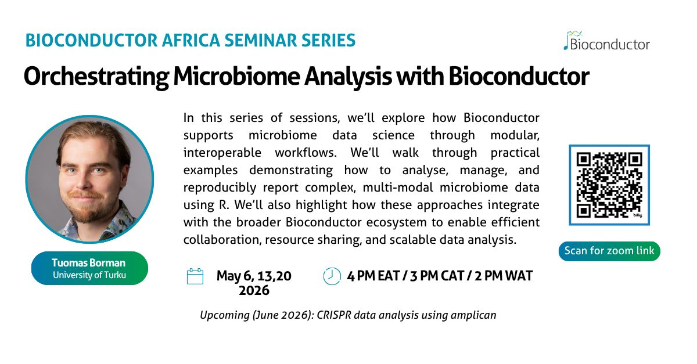

## Overview

The Bioconductor Africa Seminar Series is an online seminar series highlighting the use of Bioconductor for biological data analysis, with a focus on topics relevant to researchers across Africa and beyond.

The series includes introductory and thematic sessions led by members of the Bioconductor community, and is open to anyone interested in Bioconductor and related workflows.

**Series coordination:** Laurah Nyasita Ondari (IITA, Kenya)

## Upcoming seminars

### Featured seminar

{width="85%" fig-alt="Microbiome analysis seminar series poster"}

A three‑part series led by Tuomas Borman (University of Turku, Finland).

- Dates:
  - May 6, 2026
  - May 13, 2026 
  - May 20, 2026
- Time: 4 PM EAT / 3 PM CAT / 2 PM WAT

Each session will walk through practical examples demonstrating how to analyse, manage, and reproducibly report microbiome data using R and Bioconductor.

### Additional upcoming seminar

**CRISPR amplicon data analysis using Bioconductor**

- Date: June 2026
- Details: To be announced

  <h2>Stay connected with Bioconductor Africa</h2>
  
Sign up to receive seminar links, reminders, and announcements about future Bioc Africa activities.

  <iframe src="../2025-03-Nairobi/biocafrica-mailing-list.html" width="100%" height="350" style="border:none;"></iframe>

## Past seminars

Curious what the Bioconductor Africa seminars are like?  
Recordings from previous sessions are available below.

### Introduction to Bioconductor

- Date: 15 April 2026
- Presenter: Kevin Rue-Albrecht (University of Oxford, UK)

  <iframe
    width="100%"
    style="aspect-ratio: 16 / 9;"
    src="https://www.youtube.com/embed/ZbwOvgVTWF8"
    title="Introduction to Bioconductor – Bioconductor Africa Seminar Series"
    frameborder="0"
    allowfullscreen>
  </iframe>

This introductory session provides an overview of the Bioconductor project and
ways to get involved in the community.

## Format and recordings

- Seminars are held online.
- Registration is required to receive the live link.
- Where possible, recordings and slides will be shared after the session.

## Get involved

If you are interested in:

- giving a seminar,
- suggesting topics, or 
- contributing to Bioconductor Africa activities,

please get in touch via the [Bioconductor Zulip](https://chat.bioconductor.org) #bioc_africa channel or by direct message.

## Support and funding

The Bioconductor Africa Seminar Series is supported by the Bioconductor community and funded in part by the Chan Zuckerberg Initiative through the Essential Open Source Software for Science (EOSS) Cycle 6 programme.

This work forma part of Bioconductor’s broader efforts to expand global training, community engagement, and capacity building.

For more details on the funded projects, see:
- [Bioconductor projects funded by CZI EOSS Cycle 6](https://blog.bioconductor.org/posts/2024-07-12-czi-eoss6-grants/)

Bioc Africa activities are developed in collaboration with partners and contributors across the Bioconductor community and African research institutions.
